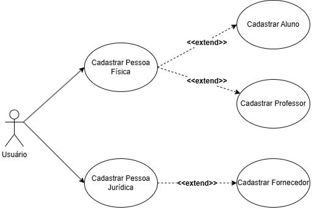
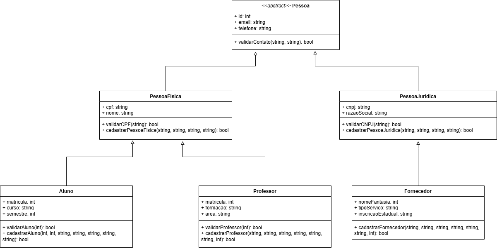

# Projeto Integrador: Desenvolvimento de Sistemas Orientado a Objetos - Gestão Universitária

_Imagem conceitual da tela de Login da JOS University, demonstrando o design da interface._

## 📝 Tabela de Conteúdo

*   [Sobre o Projeto](#-sobre-o-projeto)
*   [Objetivo](#objetivo)
*   [Funcionalidades Principais](#funcionalidades-principais)
*   [Modelagem do Sistema](#modelagem-do-sistema)
    *   [Diagrama de Casos de Uso (UML)](#diagrama-de-casos-de-uso-uml)
    *   [Cenários dos Casos de Uso](#cenários-dos-casos-de-uso)
        *   [Cadastrar Pessoa Física](#cadastrar-pessoa-física)
        *   [Cadastrar Pessoa Jurídica](#cadastrar-pessoa-jurídica)
        *   [Cadastrar Aluno](#cadastrar-aluno)
        *   [Cadastrar Professor](#cadastrar-professor)
        *   [Cadastrar Fornecedor](#cadastrar-fornecedor)
    *   [Diagrama de Classes (UML)](#diagrama-de-classes-uml)
*   [Protótipos de Interface (Figma)](#protótipos-de-interface-figma)
*   [Conclusão da Primeira Entrega](#conclusão-da-primeira-entrega)
*   [Próximos Passos](#próximos-passos)
*   [Como Contribuir](#como-contribuir)
*   [Licença](#licença)
*   [Autores](#autores)
*   [Agradecimentos](#agradecimentos)

---

## 📝 Sobre o Projeto

Este repositório documenta a primeira e segunda etapa de um Projeto Integrador desenvolvido para a disciplina de Análise de Sistemas, com foco primordial na **modelagem de um sistema orientado a objetos** para a **gestão de dados de uma universidade fictícia, a JOS University**. O objetivo central da primeira fases foi estabelecer a estrutura conceitual e operacional do sistema, abordando a administração de diferentes tipos de usuários e entidades que interagem com a instituição de ensino.

A modelagem foi meticulosamente elaborada seguindo os princípios da Orientação a Objetos e utilizando a notação padrão da UML (Unified Modeling Language), garantindo uma representação clara e robusta dos elementos do sistema e seus relacionamentos. Este documento não apenas descreve a arquitetura proposta, mas também detalha os casos de uso e protótipos de interface que visualizam a interação do usuário com o sistema.

Como destacado na *Introdução* do documento:
> "Este documento apresenta a execução prática da primeira etapa do Projeto Integrador da disciplina de Análise de Sistemas, com foco na modelagem de um sistema orientado a objetos. O tema dessa entrega é a gestão de dados de uma universidade, abordando os cadastros de diferentes tipos de pessoas que interagem com o sistema, como alunos, professores, fornecedores, pessoas físicas e jurídicas."

Na segunda fase, foi criado um protótipo do sistema para demonstrar como ficaria implementado na prática a modelagem feita na primeira etapa, com a criação das telas da interface de usuário através da ferramenta Figma.

O projeto visa criar uma base sólida para um sistema de gestão universitária eficiente e escalável, com ênfase na reutilização de código e facilidade de manutenção, características cruciais em projetos de software modernos.

## Objetivo

Os principais objetivos da primeria e segunda entrega foram a modelagem conceitual de um sistema de cadastro e gestão de pessoas dentro de um contexto universitário, e a criação de um protótipo com a implementação desse sistema. Isso incluiu a definição clara das entidades, suas interações e as funcionalidades essenciais para gerenciar informações de alunos, professores, fornecedores, e pessoas físicas/jurídicas em geral. A ideia é estabelecer um alicerce robusto para o desenvolvimento futuro de uma aplicação completa.

## Funcionalidades Principais

As funcionalidades identificadas e modeladas nesta fase concentram-se no gerenciamento de cadastros, sendo elas:

*   **Cadastrar Pessoa Física**: Permite o registro de indivíduos com dados essenciais como nome, CPF, data de nascimento, e-mail e telefone.
*   **Cadastrar Pessoa Jurídica**: Habilita o registro de entidades jurídicas, como empresas, com informações como razão social, CNPJ, e-mail, telefone e endereço.
*   **Cadastrar Aluno**: Permite associar uma pessoa física já cadastrada como aluno, incluindo informações específicas como número de matrícula, curso e semestre.
*   **Cadastrar Professor**: Possibilita associar uma pessoa física já cadastrada como professor, adicionando detalhes como formação, área de atuação e matrícula.
*   **Cadastrar Fornecedor**: Permite associar uma pessoa jurídica já cadastrada como fornecedor, com dados adicionais como nome fantasia, tipo de serviço e inscrição estadual.

Essas funcionalidades são a base para a gestão de usuários e parceiros da universidade, garantindo a organização e a integridade dos dados.

## Modelagem do Sistema

A modelagem do sistema foi realizada utilizando os conceitos da Orientação a Objetos e a notação da UML (Unified Modeling Language), conforme descrito em *Introdução* do documento. Esta abordagem permite uma representação clara da estrutura de dados e dos fluxos de interação.

### Diagrama de Casos de Uso (UML)

O Diagrama de Casos de Uso descreve as funcionalidades principais do sistema sob a perspectiva do usuário. O ator principal, **Usuário**, que pode representar um funcionário da secretaria da universidade, interage com todos os casos de uso de cadastro.

No *Diagrama de Casos de Uso (UML)*, são detalhados os atores e casos de uso:
> "O usuário é o ator principal que realiza todos os cadastros, podendo ser uma representação da secretaria ou funcionário da universidade responsável por cadastrar alunos, professores e fornecedores. Baseado no ponto 1 do enunciado, dividimos as funcionalidades em cinco casos de usos de principais.
> Atores:
> ● Usuário
> ● Sistema
> Casos de Uso:
> ● Cadastrar Pessoa Física
> ● Cadastrar Pessoa Jurídica
> ● Cadastrar Aluno
> ● Cadastrar Professor
> ● Cadastrar Fornecedor"

As relações entre os casos de uso são notáveis pela extensão de funcionalidades:
> "Relações:
> ● O ator Usuário (que pode ser considerado um funcionário da secretaria da universidade) interage com todos os casos de uso.
> ● Os casos "Cadastrar Aluno" e "Cadastrar Professor" estendem "Cadastrar Pessoa Física".
> ● O caso "Cadastrar Fornecedor" estende "Cadastrar Pessoa Jurídica"."

Esta estrutura de herança nos casos de uso sugere uma arquitetura modular e eficiente, onde as funcionalidades mais específicas (Aluno, Professor, Fornecedor) reusam a lógica de cadastro de entidades genéricas (Pessoa Física, Pessoa Jurídica).

### Cenários dos Casos de Uso

Cada caso de uso foi detalhado com cenários principal e alternativos, descrevendo o fluxo de interação e as validações do sistema.

#### Cadastrar Pessoa Física

*   **Atores**: Usuário
*   **Pré-condição**: O usuário está autenticado no sistema.
*   **Cenário Principal**: O usuário acessa o módulo, preenche dados obrigatórios (nome completo, CPF, data de nascimento, e-mail, telefone), o sistema valida e armazena as informações, confirmando o cadastro com sucesso.
*   **Cenários Alternativos**:
    *   **CPF inválido**: O sistema detecta CPF em formato inválido ou já existente, exibindo mensagem de erro.
    *   **Campos obrigatórios em branco**: O sistema verifica campos não preenchidos, exibe mensagem de erro e impede o envio.
*   **Pós-condição**: Pessoa física cadastrada com sucesso.

#### Cadastrar Pessoa Jurídica

*   **Atores**: Usuário
*   **Pré-condição**: Usuário autenticado no sistema.
*   **Cenário Principal**: O usuário acessa o cadastro, informa razão social, CNPJ, e-mail, telefone e endereço. O sistema valida o CNPJ e demais dados, registra no banco e confirma o cadastro.
*   **Cenários Alternativos**:
    *   **CNPJ inválido**: O sistema detecta CNPJ em formato inválido ou já existente, exibindo mensagem de erro.
    *   **Campos obrigatórios em branco**: O sistema verifica campos não preenchidos, exibe mensagem de erro e impede o envio.
*   **Pós-condição**: Empresa cadastrada no sistema.

#### Cadastrar Aluno

*   **Atores**: Usuário
*   **Pré-condição**: Pessoa física previamente cadastrada.
*   **Cenário Principal**: O usuário acessa o cadastro de aluno, informa nome e CPF da pessoa física, o sistema valida a existência da pessoa física, o usuário informa número de matrícula, curso e semestre. O sistema valida se o aluno já está cadastrado, associa à pessoa física existente, armazena no banco e confirma.
*   **Cenários Alternativos**:
    *   **Pessoa física não encontrada**: O sistema verifica que a pessoa física não existe, exibe erro e oferece opção de cadastrar uma nova pessoa física ou tentar novamente.
    *   **Número de matrícula já cadastrado**: O sistema detecta matrícula duplicada, exibe erro e impede o envio.
*   **Pós-condição**: Aluno associado à pessoa física no sistema.

#### Cadastrar Professor

*   **Atores**: Usuário
*   **Pré-condição**: Pessoa física previamente cadastrada.
*   **Cenário Principal**: Semelhante ao cadastro de aluno, o usuário acessa o cadastro de professor, informa nome e CPF da pessoa física, o sistema valida a existência da pessoa física, o usuário informa formação, área de atuação e matrícula. O sistema valida os dados, associa à pessoa física existente, armazena no banco e confirma.
*   **Cenários Alternativos**:
    *   **Pessoa física não encontrada**: O sistema verifica que a pessoa física não existe, exibe erro e oferece opção de cadastrar uma nova pessoa física ou tentar novamente.
    *   **Matrícula duplicada**: O sistema detecta matrícula duplicada, exibe erro e impede o envio.
*   **Pós-condição**: Professor associado à pessoa física no sistema.

#### Cadastrar Fornecedor

*   **Atores**: Usuário
*   **Pré-condição**: Pessoa jurídica previamente cadastrada.
*   **Cenário Principal**: O usuário acessa o cadastro de fornecedor, informa CNPJ, o sistema valida a existência da pessoa jurídica, o usuário informa nome fantasia, tipo de serviço e inscrição estadual. O sistema associa à pessoa jurídica existente, armazena no banco e confirma.
*   **Cenários Alternativos**:
    *   **Pessoa jurídica não encontrada**: O sistema verifica que a pessoa jurídica não existe, exibe erro e oferece opção de cadastrar uma nova pessoa jurídica ou tentar novamente.
*   **Pós-condição**: Fornecedor ativo no sistema.

Esses cenários detalham o comportamento esperado do sistema e as interações do usuário, fundamentais para o desenvolvimento de uma aplicação robusta e amigável.

### Diagrama de Classes (UML)

O Diagrama de Classes é essencial para representar a estrutura de dados e os relacionamentos entre as entidades do sistema. Um conceito fundamental aplicado foi a criação de uma classe abstrata `Pessoa`.

Conforme descrito na seção *Diagrama de Classes (UML)*:
> "Criamos uma classe abstrata “Pessoa” com atributos comuns, como email e telefone, para que fosse possível a reutilização. A ideia é que outras classes possam herdar dessa classe abstrata e ter um estrutura que favorece a reutilização de código, e que facilita a manutenção do sistema."

Esta abordagem de herança, com `Pessoa` como classe base, garante a reutilização de código e a manutenção facilitada, alinhando-se aos princípios da Orientação a Objetos. Classes como `PessoaFisica`, `PessoaJuridica`, `Aluno`, `Professor` e `Fornecedor` provavelmente herdarão ou terão associações com essa classe abstrata, permitindo uma modelagem flexível e extensível.

## Protótipos de Interface (Figma)

Para complementar a modelagem e visualizar a experiência do usuário, foram desenvolvidos protótipos de interface utilizando a ferramenta Figma. A universidade fictícia para a qual o sistema foi projetado é a **JOS University**.

Os protótipos incluem as seguintes telas, demonstrando o fluxo de interação do usuário:

*   [**Tela de Login**](images/login.png): O ponto de entrada do sistema.

*   [**Tela da Área Logada - Menu de Cadastros**](images/area_logada.png): O painel principal após o login, com opções para acessar os diferentes módulos de cadastro.

*   [**Tela de Cadastro de Pessoa Física**](images/pessoa_fisica.png): Interface para o registro de indivíduos.

*   [**Tela de Cadastro de Pessoa Jurídica**](images/pessoa_juridica.png): Interface para o registro de empresas.

*   [**Tela de Cadastro de Aluno**](images/aluno.png): Interface para associar e cadastrar alunos.

*   [**Tela de Cadastro de Professor**](images/professor.png): Interface para associar e cadastrar professores.

*   [**Tela de Cadastro para Fornecedor**](images/fornecedor.png): Interface para associar e cadastrar fornecedores.

*   [**Tela de Busca de Cadastro**](images/cadastro.png): Uma tela para pesquisar e gerenciar cadastros existentes.

Esses protótipos são cruciais para validar o design da solução e a usabilidade do sistema, permitindo que as partes interessadas visualizem como o sistema funcionará antes mesmo de qualquer linha de código ser implementada. Embora as imagens não estejam diretamente neste README, a menção delas e seu propósito é vital para a documentação do projeto.

## Conclusão

A primeira entrega deste Projeto Integrador solidificou a base conceitual para o desenvolvimento de um sistema de cadastro e gestão de pessoas em um ambiente universitário. A utilização de conceitos de Orientação a Objetos e UML permitiu uma modelagem clara e eficiente, focada na reutilização de código, facilidade de manutenção e clareza na visualização da arquitetura do sistema.

Conforme a *Conclusão* do documento:
> "Este projeto representa um sistema simples de cadastro e gestão de pessoas em uma universidade, utilizando conceitos de orientação de objetos e UML. A modelagem foi pensada para garantir reutilização de código, facilidade de manutenção e clareza na visualização, características fundamentais em projetos de software modernos."

Além disso, na segunda entrega, a criação dos protótipos de interface no Figma serviu como uma ferramenta valiosa para explorar o design da solução e prever a interação do usuário, garantindo que o desenvolvimento futuro seja guiado por uma experiência de usuário bem planejada. Esta fase demonstra um planejamento robusto e uma compreensão aprofundada dos requisitos do sistema.

## Próximos Passos

Os próximos passos deste projeto poderiam incluir:

*   **Implementação do Backend**: Desenvolvimento da lógica de negócios e da camada de persistência de dados.
*   **Implementação do Frontend**: Desenvolvimento das interfaces de usuário com base nos protótipos do Figma.
*   **Testes**: Realização de testes unitários, de integração e de sistema para garantir a qualidade do software.
*   **Documentação Adicional**: Criação de documentação técnica para o código e guias de instalação/uso.

Este repositório servirá como a fonte de verdade para a documentação e evolução do projeto.

## Como Contribuir

Agradecemos o interesse em contribuir com este projeto! Atualmente, este repositório serve principalmente como documentação da fase de modelagem. No entanto, se você tiver sugestões, ideias ou quiser colaborar nas próximas fases de desenvolvimento, sinta-se à vontade para:

1.  **Abrir uma Issue**: Para relatar bugs, sugerir novas funcionalidades ou discutir melhorias na documentação.
2.  **Fazer um Fork e Pull Request**: Caso queira propor alterações diretas no conteúdo ou na estrutura da documentação (lembre-se de que esta é uma fase inicial, então o código ainda não está presente).

Por favor, certifique-se de que suas contribuições estejam alinhadas com o objetivo e a abordagem do projeto.

## Licença

Este projeto está licenciado sob a licença MIT.

## Autores

Este projeto foi desenvolvido pelos seguintes alunos do Grupo 19:

*   **Jeferson Oliveira dos Santos** (jeferson.rjrn@gmail.com)
*   **André Ikejiri Hilario** (andre18hilario@gmail.com)

A dedicação e o esforço de ambos foram fundamentais para a execução e documentação desta primeira etapa.

## Agradecimentos

Gostaríamos de expressar nossa gratidão aos professores da disciplina de Análise de Sistemas por nos guiar neste projeto e por fornecerem o conhecimento necessário para a modelagem de sistemas orientados a objetos.

---